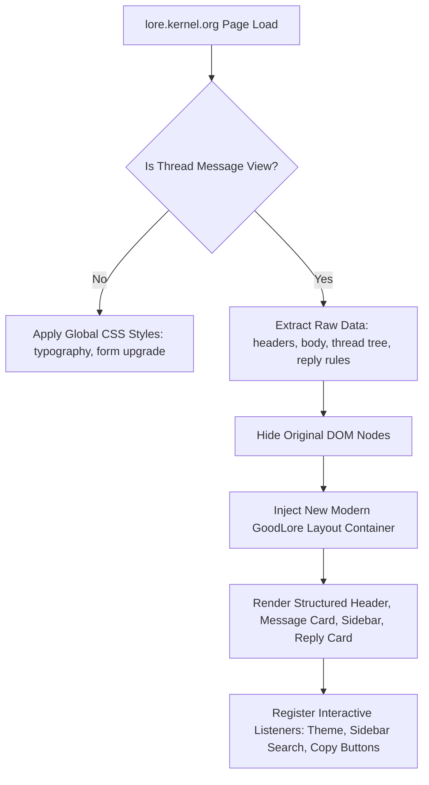

# GoodLore 🧬

> A premium, modern, and highly interactive user experience for [lore.kernel.org](https://lore.kernel.org/).

**GoodLore** is a Tampermonkey/Violentmonkey userscript that transforms the retro, plain-text mailing list interface of `lore.kernel.org` into a beautiful, productive, and developer-friendly discussion platform (similar to GitHub or Linear) while preserving 100% of the underlying mailing list features.

## 🌟 Key Features

- 🌓 **Dynamic Theme System**: Sleek modern dark mode (default) and clean light mode, with automatic system synchronization and manual overrides.
- 🎨 **Premium Typography**: Integrates Google Fonts (`Plus Jakarta Sans` for headers, `Inter` for UI, and `JetBrains Mono` for code and emails).
- 🌳 **Interactive Hierarchical Thread Tree**:
  - Shows parent-child relationships with visual line guidelines.
  - Highlights the current message dynamically.
  - Instantly scroll-aligns the active conversation into view.
- 🔍 **Sidebar Thread Filtering**: Filter hundreds of replies instantly by author or subject in real-time.
- 📋 **One-Click Commands & Copying**:
  - Pre-formatted `git send-email` codeblocks with copy buttons.
  - Copy absolute/relative message IDs and raw email text directly.
  - Direct mailto links and raw mbox downloads.
- 🏷️ **Collapsible Metadata Cards**: Hide/show recipients (To/Cc) list under sleek profile avatars with initials.
- 🟢🔴 **High-Fidelity Diff Styling**: Renders code patches (`.add` and `.del`) with modern syntax-highlighted backgrounds.
- 🌐 **Global Styles Upgrade**: Non-thread pages (such as index and search results) automatically receive upgraded styling (clean inputs, modern buttons, proper table borders) without breaking default public-inbox features.

---

## 🚀 Installation

1. Install a userscript manager extension in your browser:
   - **Tampermonkey**: [Chrome/Edge/Opera](https://chrome.google.com/webstore/detail/tampermonkey/dhdgffkkebhmkfjojejmpbldmpobfkfo) / [Firefox](https://addons.mozilla.org/firefox/addon/tampermonkey/)
   - **Violentmonkey**: [Chrome/Firefox](https://violentmonkey.github.io/)
2. Open the compiled userscript file: [dist/goodlore.user.js](file:///home/soda/src/goodlore/dist/goodlore.user.js).
3. Copy the entire contents of the script.
4. Open your userscript manager, click **Create a new script**, paste the code, and save (`Ctrl+S`).
5. Visit any [lore.kernel.org](https://lore.kernel.org/) page (e.g. [this thread](https://lore.kernel.org/all/3a5d891b536588e8e4fc84d60a5c8af72091d852.camel@redhat.com/)) to see the magic happen!

---

## 💻 Vite Development Workflow

This project is configured with Vite and `vite-plugin-monkey` to enable modern development practices (like compilation, code splitting, and hot module reloading):

### Available Scripts:
- `pnpm install`: Installs the required packages.
- `pnpm run dev`: Starts the local development server at `http://localhost:5173/`. 
  - Install the served dynamic loader script in your userscript manager *once*. Any changes you make to `src/main.js` will instantly reload in the browser!
- `pnpm run build`: Bundles, optimizes, and compiles the production script to `dist/goodlore.user.js`.

---

## 🛠️ Architecture and Core Design

The userscript performs a DOM restructuring at runtime on single-message/thread pages (`https://lore.kernel.org/*/message-id/`):

## 📄 License
This project is open-source and available under the MIT License.
